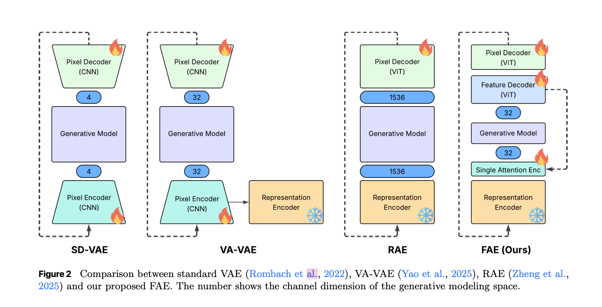
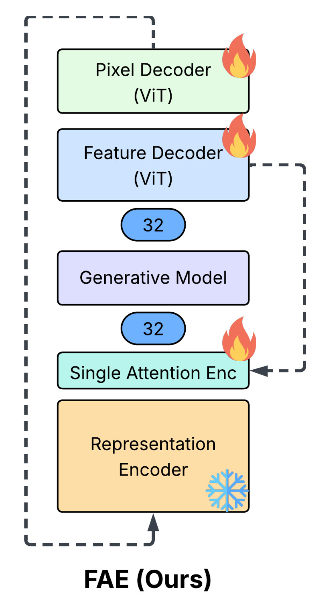
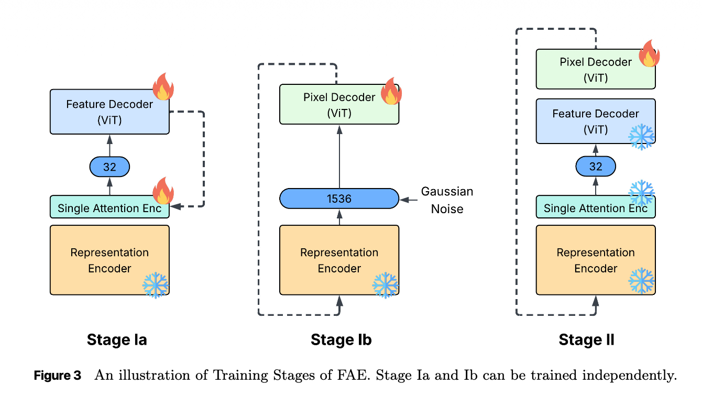

# One Layer Is Enough: Adapting Pretrained Visual Encoders for Image Generation

Latent Diffusion Models made generation cheap by moving the heavy lifting into a small, compressed latent space instead of raw pixels. But a new question has taken over the field since: instead of training a VAE from scratch to build that latent space, why not just reuse a pretrained visual encoder like DINOv2 or SigLIP that already understands images extremely well?

That sounds obvious. But it isn't. The features these encoders produce are built for understanding images, not generating them, and these two jobs pull in opposite directions.

Before we start, these are a few terms we'll keep reusing:

- $x$: A patch embedding coming out of a frozen, pretrained encoder (e.g., DINOv2).
- $z$: The compact latent that we compress $x$ into.
- $\hat{x}$: The reconstructed version of $x$, decoded back out of $z$.
- $\theta$: The learnable weights of whichever network we're training at that step.

## The Core Problem

Self-supervised encoders like DINOv2 are trained on masked prediction and guess the missing patch. To represent all the plausible things that could be under the mask, these models want **large, high-dimensional embeddings** (like DINOv2-g uses 1,536 dimensions!).

Generative models want the opposite. A diffusion model has to track a noisy input and its clean target through hundreds of denoising steps, and that process gets unstable fast if the latent space is huge. Generation prefers **small latents**  usually between 4 and 64 dimensions.

So we're stuck: if we keep the pretrained features large and rich, then the diffusion model destabilizes. Compress them down, and we risk throwing away the semantics that make the pretrained encoder useful in the first place.

## Phase 1: Building the Components

Let's assume FAE is just a machine. This "machine" has three components bolted onto a frozen, pretrained encoder that never gets touched during training.

### 1. The Single-Attention Encoder

This is the whole trick of the paper. Instead of building a deep, multi-layer network to compress the pretrained embedding $x$ down into a small latent $z$, the authors use **one self-attention layer followed by a linear projection**. That. is. it.

Why so shallow? Isn't this supposed to be DEEP Learning! Because compressing features is a much easier task than the original masked-prediction pretraining objective was. If we give a deep, powerful encoder an easy job, and it will easily overfit, reshaping the features into whatever makes the reconstruction loss small and discarding information that isn't directly supervised but might still be semantically useful. Keeping the encoder shallow keeps $z$ close to the original embedding, not a distorted re-encoding of it.

The one attention layer is specifically there to let patches "speak" with each other and take out and redundant global information that's repeated across the image, which is something a plain linear layer working dimension-by-dimension can't do.

### 2. The Feature Decoder

Once we have the compact latent $z$, we need to get back to something usable. The first decoder's only job is to reconstruct the original pretrained embedding. Not into pixels yet, just into the feature space.

$$\mathcal{L}_{VAE} = \| \hat{x} - x \|_2^2 + \beta\, \text{KL}\big(q(z \mid x) \,\|\, p(z)\big)$$

This is a 6-layer transformer, built with RoPE, RMSNorm, and SwiGLU for stability, matched to the hidden dimension of whatever backbone it's paired with (DINOv2, SigLIP, etc.). The loss is deliberately simple (just L2 plus a KL term) because a simple objective keeps the reconstructed embedding $\hat{x}$ compatible with whatever downstream task the original pretrained model was good at.

### 3. The Pixel Decoder

Now, on top of the reconstructed embedding $\hat{x}$, a second decoder translate features into actual RGB pixels. This is something like **the feature decoder is restoring the "language" the pretrained encoder speaks, and the pixel decoder as translating that language into an image.** It's trained with a mix of adversarial, perceptual, and pixel-reconstruction losses, the same way LDM-style VAEs use to keep outputs sharp instead of blurry.

Splitting feature reconstruction and pixel synthesis apart is why the paper calls this the **"double decoder"** design.

### 4. The Generative Model

With the latent space $z$ built and frozen, any generator can be trained directly on top of it, with no architecture changes required. The paper uses either **SiT**, a diffusion model, or **STARFlow**, a normalizing flow model. Both are used pre-built and the only change is swapping their native latent for FAE's $z$.

## Phase 2: How It All Runs Together

1. A frozen pretrained encoder (DINOv2, SigLIP, whichever) turns an image into a high-dimensional embedding $x$.
2. The **single-attention encoder** compresses $x$ into a small latent $z$ (this is the only new trainable piece added to the frozen backbone).
3. The **feature decoder** reconstructs $\hat{x}$ from $z$, trained with a simple VAE objective to stay close to the original embedding.
4. The **pixel decoder** turns $\hat{x}$ into a real image, learning this mapping first from noised embeddings (so it becomes robust) and then fine-tuning on the actual reconstructed $\hat{x}$.
5. Separately, a diffusion model or normalizing flow model is trained to generate new samples of $z$ iteratively from sampling noise to denoising step by step.
6. At generation time: sample noise in latent space → denoise into a clean $z$ → decode through the feature decoder to get $\hat{x}$ → decode through the pixel decoder to get pixels.

The surprising part is how little is needed to make this work. One attention layer is enough to bridge a 1,536-dimensional understanding space and a 32-dimensional generation space, while keeping both reconstruction quality and downstream understanding (linear probing, image-text retrieval) nearly intact.

## Why Keep It So Simple?

Two existing strategies already try to solve our Core Problem using:

- **Feature alignment** (e.g., REPA, VA-VAE): train the generator or its VAE to align with a pretrained encoder's features. This needs carefully tuned alignment losses and extra training stages, and still discards information that doesn't fit the generator's native architecture.
- **Direct modeling** (e.g., RAE): use the pretrained embeddings as the latent space directly. This avoids alignment losses but forces the generator to use wider channels, extra heads to handle the huge embedding dimension.

FAE: keep the generator small and standard by feeding it a genuinely low-dimensional latent, but keep that latent semantically close to the original pretrained features by training the compression with almost no capacity to distort it. The result — near state-of-the-art FID scores on ImageNet and MS-COCO, using a fraction of the training data and epochs competing methods need, all from a design you could sketch on a napkin: one attention layer, two decoders.

## Two-Cents

FAE's core contribution is a counterintuitive one. When adapting pretrained visual representations for generation, less architecture is more. Its single-attention-layer encoder challenges our "DEEP Learning" instinct to use deeper, more complex adapters, showing minimal design better preserves the semantics worth keeping. The double-decoder split i.e. reconstructing features before reconstructing pixels shows how much can be gained by simply separating concerns that prior work bundled together. However, its rFID still trails reconstruction-first methods like VA-VAE, a reminder that FAE trades off some pixel-level fidelity for its simplicity and speed. Future work might explore whether an explicit image-reconstruction signal can be folded back in without sacrificing the minimalism that makes FAE work in the first place.
